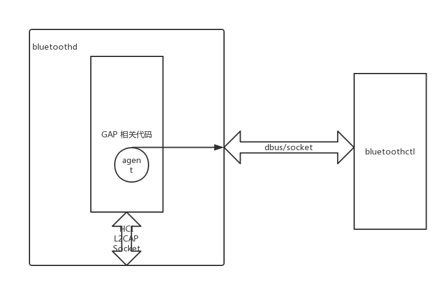

<!-- $theme: gaia -->
<!-- page_number: true -->
# **==BLUEZ==**<br/>简介
###### *duyh@haierubic.com*
###### 2017/05/19


---
# BLUEZ
BlueZ是Linux官方蓝牙协议栈,基于GPL发布的开源项目，最新版本5.45，协议栈分为内核态和用户态两部分http://www.bluez.org/
+ 内核态－<small>主要是一些核心协议的实现和一些设备驱动，对用户态提供socket接口</small>
+ 用户态－<small>主要是一个daemon进程实现蓝牙设备和profile的管理，还有一些命令行工具，使用socket接口同内核交互</small>

内核部分从Linux2.4.6开始便进入Linux内核进行维护


---
# 内核部分

```
int fd = socket(PF_BLUETOOTH,SOCK_RAW,BTPROTO_HCI);
int fd = socket(AF_BLUETOOTH,SOCK_SEQPACKET,BTPROTO_L2CAP);
int fd = socket(AF_BLUETOOTH,SOCK_STREAM,BTPROTO_RFCOMM);
```


---
# HCI－<small>==主机控制器接口==</small>
HCI接口通过发送和接收分组报文来完成蓝牙适配器的管理，配置，和数据通信，是bluez最底层的软件操作接口
+ ```命令分组```-<small>向蓝牙适配器发送控制命令</small>
+ ```事件分组```-<small>蓝牙适配器通知上来的事件</small>
+ ```数据分组```-<small>适配器间交互的数据包</small>
		
    
    
---
# ```命令分组```
+ 链路控制命令-<small>扫描，连接，PIN请求等</small>
+ 链路策略命令-<small>模式，服务质量，角色管理等</small>
+ 主机控制器与基带命令-<small>读写设备名，扫描时间参数等</small>
+ 信息命令-<small>读取蓝牙版本，HCI缓冲容量等</small>
+ 状态命令-<small>读取连接句柄的状态等</small>
+ 测试命令-<small>回环模式下读写测试等</small>


---
# ```事件分组```
+ 通用事件-<small>包括命令完成包和命令状态包</small>
+ 出错事件-<small>如产生丢失和数据缓冲区溢出</small>
+ 测试事件-<small>测试模式下发出的事件</small>


---
# ```数据分组```
+ ACL-<small>异步无连接分组</small>
+ SCO-<small>同步有连接分组</small>


---
# L2CAP－<small>==逻辑链路控制与适配协议==</small>
+ 协议复用-<small>底层传输协议没有提供对高层协议的复用机制,L2CAP层可以区分其上的SDP、RFCOMM、TCS等(有一个类似端口号的字段)</small>
+ 分段重组-<small>L2CAP层帮助实现基带的短PDU和高层的长PDU相互传输，L2CAP本身不完成任何PDU的分段重组，具体的分段重组有低层和高层来完成</small>
+ 服务质量信息的交换-<small>蓝牙建立连接的过程中，L2CAP允许交互蓝牙所期望的服务质量，建立完成后，通过监视资源的使用情况，来保证服务质量</small>
+ 组抽象-<small>L2CAP忽略地址组概念，他只关心数据</small>


---
# SCO & RFCOMM
+ SCO-<small>语音通话接口，向用户态提供socket接口，下层使用HCI SCO数据分组</small>
+ RFCOMM-<small>模拟串口接口，向用户态提供socket接口，下层使用L2CAP层接口</small>

基本上90%的蓝牙profile应用都是使用hci/l2cap接口完成，所以其他的接口或者协议可以暂时忽略


---
# 使用内核接口命令行工具


---
# 用户空间daemon进程和工具


---
# GAP==通用接入规范==
该Profile保证不同的蓝牙产品可以互相发现对方并建立连接，具有强制性，并作为所有其它蓝牙应用规范的基础
+ 定义角色-<small>定义主从角色，BLE时定义广播者/观察者/中心/外围</small>
+ 用户接口-<small>提供更改设备名/设备地址/Pin请求用户接口，BLE时提供更改广播数据接口</small>
+ 模式管理-<small>管理发现模式/连接模式/配对模式等</small>
+ 安全-<small>进行认证与安全的管理</small>


---
# 蓝牙建立连接过程
+ 扫描
+ 建立链路层连接
+ 配对(产生加密和认证密钥)
+ 绑定(绑定完下次连接后不需要配对，直接进行加密传输，基于长期key）
+ 建立逻辑层(L2CAP）连接...


---
# 特性交换－基于IO能力


---
# 安全简易配对
<small><small>
+ Numeric Comparison 
配对双方都显示一个6位的数字，由用户来核对数字是否一致，并输入Yes/No，两端Yes表示一致即可配对,可以防止中间人攻击。 
使用场景：两端设备可以弹出6位十进制数，并且有yes和no按钮
+ Passkey Entry 
配对目标输入一个在本地设备上显示的6位数字，输入正确即可配对，并可以防止中间人攻击
使用场景：一端设备可以显示，另一端设备可以输入
+ Just Works 
不会进行鉴权,不能防止中间人攻击用于配对没有显示没有输入的设备，主动发起连接即可配对，用户看不到配对过程，不可以防止中间人攻击，例如连接蓝牙耳机 
使用场景：用于即不能显示6位随机数，也不能输入的设备
+ Out of Band 
两设备的通过别的途径交换配对信息，例如一些NFC蓝牙音箱
</small></small>


---
# 设备发现配对演示



---
# SDP Server简介

供本机的应用profile注册自己的service记录，供sdp client测查询


---
# SDP服务发现演示


---
# A2DP 简介

Advanced Audio Distribute Profile, 
gap sdp server都是基础设施，A2DP是一个真正的应用Profile，以此为例代表所有其他的应用Profile

+ 使用L2CAP　ACL链路传送数据
+ 分为SOURCE/SINK两种服务角色
+ 强制支持SBC编码格式


---
# A2DP音频播放演示


---
# BLE简介
BLE　增加了广播包特性，用于实现beacon站，
支持GAP/GATT两种Profile


---
# ATT


---
# GATT


---
# GATT读写演示


---
# **完**


