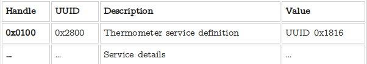
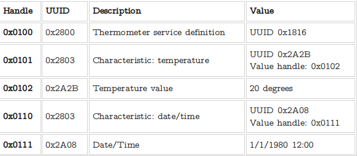

<!-- $theme: gaia -->
<!-- page_number: true -->
# **==BLUEZ==**<br/>简介
###### *duyh@haierubic.com*
###### 2017/05/19


---
# SDP Server简介

<small>供本机的应用profile注册自己的service记录，供sdp client侧查询，SDP Server由一系列服务记录组成</small>


---
# Service Record
<small><small>服务记录由一系列```属性ID/属性值```对组成
+ ```属性ID```-由16位的整数表示，代表一个固定的属性名，常见属性名如下
	+ Service Name-服务名字
	+ Service RecHandle-服务句柄，Server内唯一
	+ ServiceClassIDList-服务所属的类列表，用于标示该服务的类别和能力
	+ Service Provider－服务提供者，厂商或应用名
	+ Protocol Descriptor List－服务使用的协议列表
	+ Profile Descriptor List-服务所属Profile列表
+ ```属性值```-由类似TLV组成的可变长值，可表示简单的整数字符串，也可以表示复杂的列表</small></small>


---
# 服务记录示例

<small><small>```PSM:23```-关键信息，L2CAP端口号,客户端根据该信息就可以建立应用Profile的连接，使用该服务。
由于蓝牙的Base UUID(00000000-0000-1000-8000-00805F9B34FB)是固定的，所以上面的```0x110c 0x0100 0x0017``` UUID都用的高16/32位简写
换算方法 
128 bit UUID = 16 or 32 bit number ∗ 2^96 + Bluetooth Base UUID</small></small>


---
# SDP服务发现演示

<small><small>bluez 提供的sdp库使第三方开发者可以向bluetoothd内的sdp server注册和查询服务记录，sdptool就是使用这个库的工具</small></small>


---
# A2DP 简介
Advanced Audio Distribute Profile 高级音频分发配置。
GAP/SDPServer都是基础设施，A2DP是一个真正的应用Profile，以此为例代表所有其他的应用Profile
+ 使用L2CAP　ACL链路传送数据
+ 分为SOURCE/SINK两种服务角色
+ 强制支持SBC编码格式


---
# A2DP音频播放演示


---
# BLE简介
+ 较传统蓝牙低功耗，高安全，连接快
+ BLE增加了广播包特性，用于实现beacon站,client可以不连接设备，仅仅抓取广播包数据来使用简单服务（比如蓝牙温度计）当然也可以连接
+ 支持GAP/GATT两种Profile，所有的BLE应用都基于GATT来实现
+ GAP和传统蓝牙大同小异，但定义了广播者/观察者/中心/外围角色，添加了广播包数据配置接口
+ bluez协议栈和传统蓝牙一致，区别主要在硬件和应用Profile不同


---
# ATT(属性协议)
<small>GATT基于ATT,所以需要先了解ATT,不要和sdp server内的属性概念混淆</small>
+ <small><small>一个16位的句柄（handle）-```区分不同的属性,唯一```</small></small>
+ <small><small>一个UUID，定义了attribute的类型 -```不同的attribute可以拥有相同的UUID 类型)```</small></small>
+ <small><small>一个定长的值（value）-```value的意义完全由UUID决定```</small></small>

属性格式如下：



---
#### GATT(通用属性协议)
<small><small><small><small>GATT是所有高层LE协议的基础,它定义了attribute是如何组成服务的
一个GATT服务始于UUID为0x2800的attribute，直到下一个UUID为0x2800的attribute为止,范围内的所有attribute都是属于该服务的。
例如，一台有三种服务的设备拥有如下所示的attribute布局：

attribute并不知道自己属于哪一个service，GATT负责通过查找UUID为0x2800的attribute来划分service的handle范围。于是在这种情况下，handle变得非常重要。在例子中，属于service B的attribute的handle范围肯定落在0x0151和0x02ff之中。而该服务的UUID储存在0x2800的属性value中，也就是0x2800确定服务边界，他的value储存该服务的UUID。</small></small></small></small>


---
# Characteristic（特性)
<small><small><small><small>每个GATT service都包含一个或多个characteristic,这些characteristic负责存储service的数据和访问权限,例如一个温度计（service）一般会有一个只读的“温度”characteristic，和一个可读写的“日期时间”characteristic：

GATT通过类似发现service的方法来确定某一characteristic以及它的的handle范围。characteristic的边界UUID为0x2803，value内保存的是该characteristic的值所在的attribute的句柄和类型UUID。</small></small></small></small>


---
# Characteristic descriptors
<small><small><small><small>除了value之外，我们可以在characteristic的附加attribute里获取到其它信息。在GATT里，这些附加的attribute称为descriptor。
例如，当我们我们需要明确温度计的计量单位时，可以通过添加一个descriptor来实现：

GATT知道值为0x0104的handle是一个属于0x0101 characteristic的descriptor是因为：
它不是一个value attribute，因为value attribute的handle被指定为0x0102,而且它的handle落在两个characteristic之间。</small></small></small></small>


---
#### Client Characteristic Configuration descriptor

<small><small><small><small>这个descriptor的UUID为0x2902，有一个可读写的16位value,可以作为一个bitmap。server需要为每个绑定的client维护一个独立的value实体，client只可以读取它自己的那一份，因此称之为CCC。CCC的头两位被GATT占用，用于配置attribute的notification和indication，剩下的位目前还是处于保留的状态。</small></small></small></small>


---
## GATT读写演示
+ GATT不需要传统蓝牙SDP Server一样的东西进行服务发现
+ GATT Server本身就可以根据属性边界知道自己支持哪些服务，GATT client读取后也能知道有哪些服务
+ 对GATT Server特定服务的Characteristic进行读写就是BLE设备的交互方式
+ BLE只能进行小数据量的交互，无法取代传统蓝牙的特定应用，比如音频


---
# **完**
