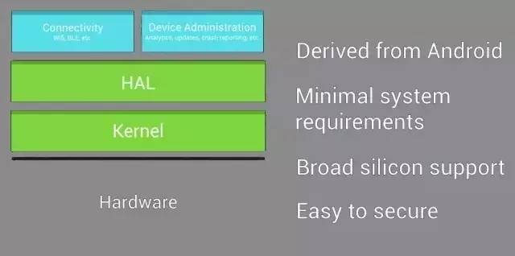
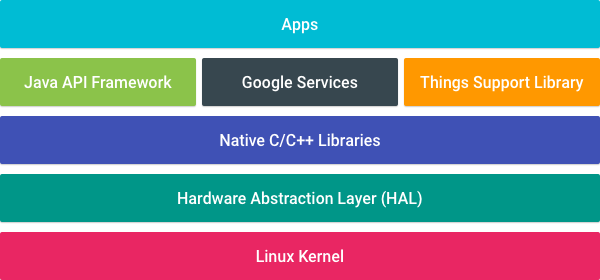
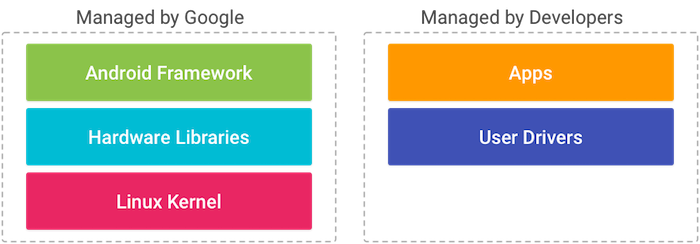
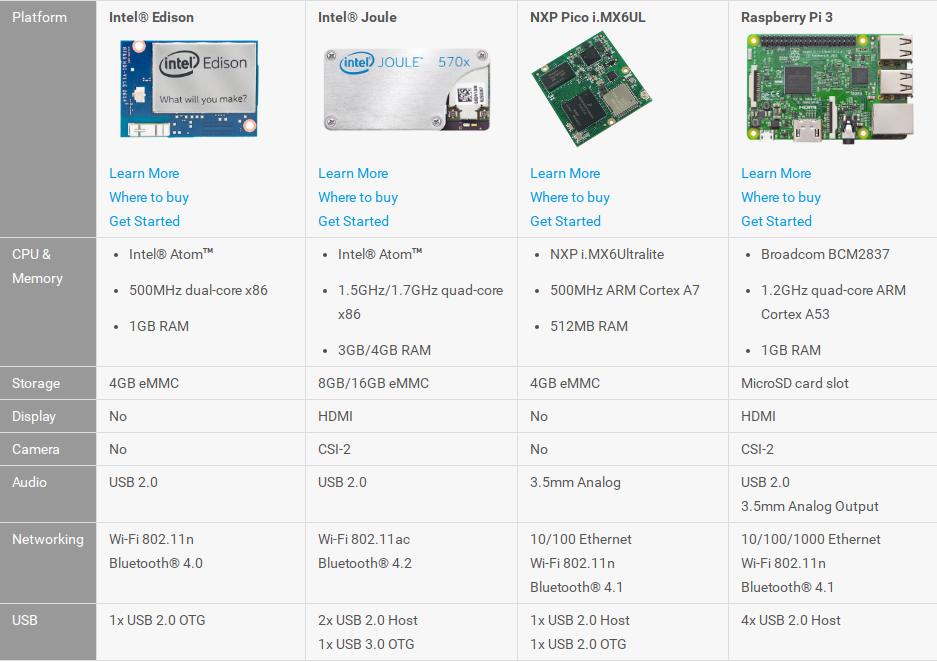

<!-- $theme: gaia -->
<!-- page_number: true -->
# **==ANDROID THINGS==** 简介
###### *duyh@haierubic.com*
###### 2017/03/27

---
# BRILLO

###### **Brillo**是*ANDROID THINGS*的前身,主要用NDK C/C++开发

---
# Android Things

###### **Android Things**通过 Java API 面向广大的 Android 和 Java 开发者，也可以利用 Android Studio 进行方便的开发和调试

---
# Android Things 特性
+ ###### things 移除了标准android中的一些不必要的组件和应用
+ ###### 新增了things support library 和一些谷歌服务
+ ###### 不支持运行时权限请求和Notifications通知
+ ###### 只支持一个应用（具有home activity）在前台接收输入事件
+ ###### 显示可选（有屏幕时显示为一个全屏的应用，可以使用通用android的ui工具包进行ui设计）
+ ###### 当前preview2版本还不支持weave和蓝牙功能(<small><small><small><small>当前已发布了preview3支持了蓝牙和usb主机功能</small></small></small></small>)

---
# 接管BSP并引入用户态驱动

###### **Android Things**通过接管内核板级BSP和HAL库使开发者可以不关注硬件和底层相关的东西，并引入用户态驱动，使用户可以通过JAVA代码进行驱动和应用开发

---
# ThingsSupportLibrary <small>==NewAPI==</small>
+ **Peripheral I/O API** 
用于访问硬件外设的API,当前支持
  1.GPIO
  2.PWM
  3.I2C/SPI/UART Serial Communication 
+ **User Driver API** 
用户态驱动注册与访问的API,当前支持
  1.GPS
  2.Input
  3.Sensors
<small><small><small>*使用用户态驱动API可以将应用同硬件解绑，使应用可移植，同时驱动也能复用*</small></small></small>

---
# 当前支持的硬件平台
 
<small><small><small>*由于谷歌接管了BSP和开放了用户态驱动，估计android things不会开源，仅支持流行的硬件，目前可以下载特定平台的系统镜像进行烧录，使用Android Studio 2.2及以上进行APP开发*</small></small></small>

---
# **完**

