<!-- $theme: gaia -->
<!-- page_number: true -->
# **==Weave libiota==**<br/>简介
###### *duyh@haierubic.com*
###### 2017/03/28


---
# WEAVE
###### <small>**Weave**是一套辅助设备厂商接入设备到谷歌云服务的通信框架，包括**Weave Device SDK**和**Weave Server**两部分：</small>
+ <small><small>**Weave Device SDK (libiota)**—连接设备到**Weave Server**的一套轻量级SDK,目前支持Linux, Qualcomm QCA4010和Marvell MW302</small></small>
+ <small><small>**Weave Server**-云服务负责安全设备注册，命令转发，状态存储，服务集成(如谷歌助手)</small></small>
###### <small>当前支持的设备类型有：HVAC controller（采暖通风与空调）, light, outlet(插座), television, and wall switch</small>
<small><small>`移动APP开发者还没有对应的SDK,需要等将来的更新,开发者目前可以用命令行工具或者Weave Developer app或者网页IoT Developer Console进行测试`</small></small>


---
###### 标准Traits(特性)
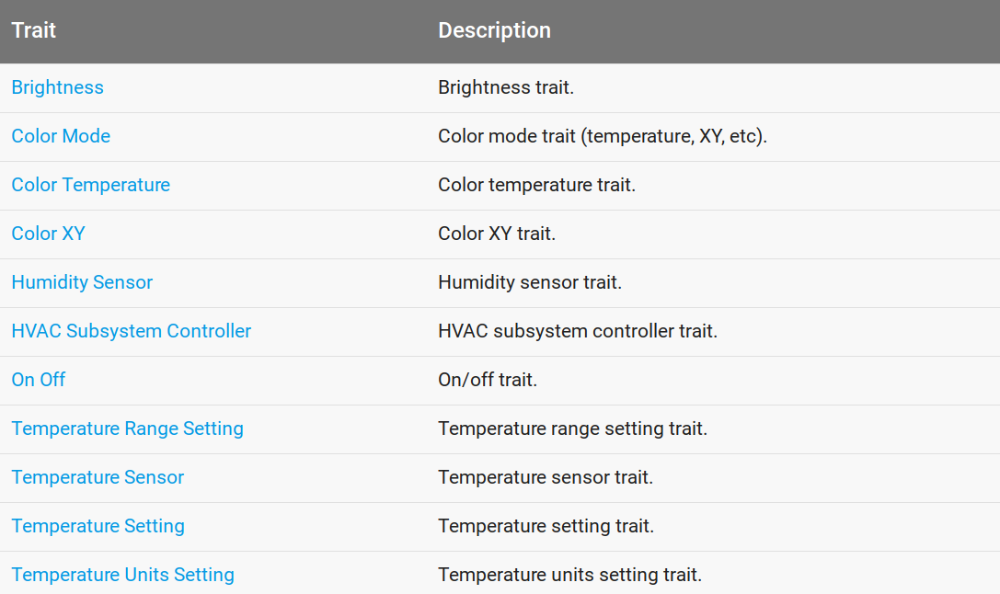
<small><small>谷歌定义了很多标准的traits供设备侧选取</small></small>


---
###### 以Brightness Trait为例
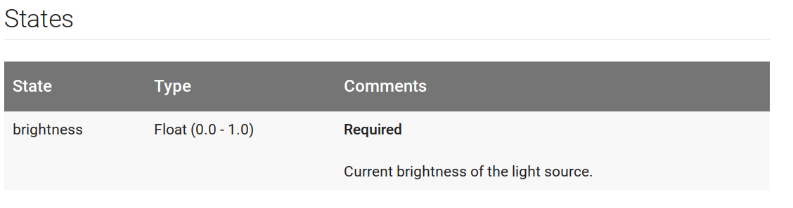
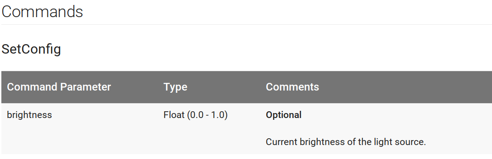
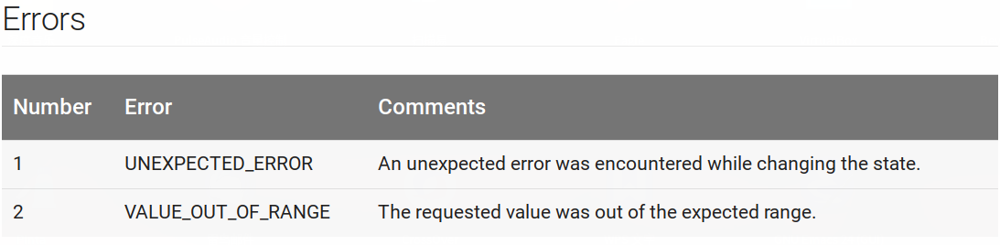
<small><small>trait由states,commands,errors三部分构成，一般情况下只有一个state和一个command</small></small>


---
###### 以TempRangeSetting Trait为例
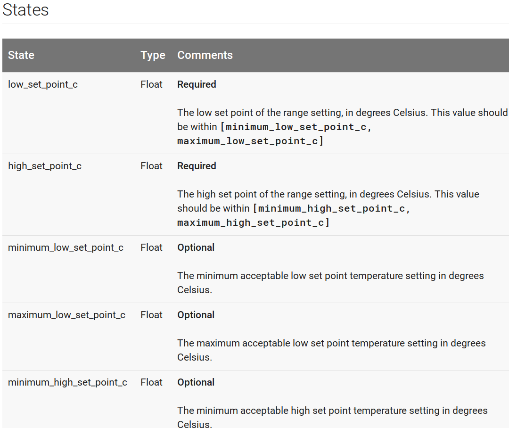
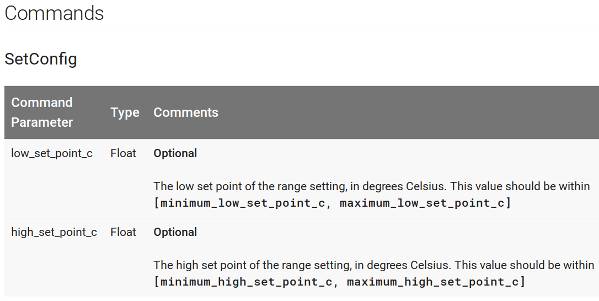
<small><small>具有多个state和多个command，只有部分state可更改</small></small>


---
###### 以TempSensor Trait为例
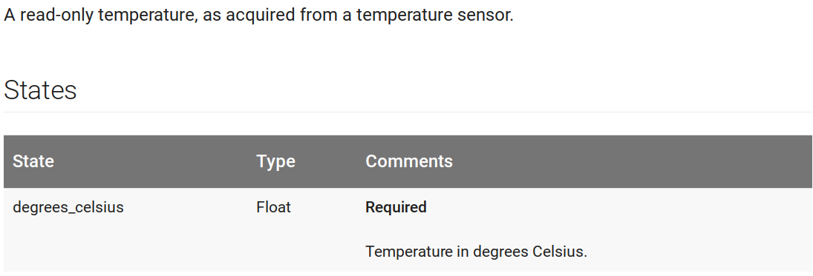
<small><small>该Trait只能上报，只有state，没有command</small></small>


---
###### States类型（一)
布尔型

整型

浮点型
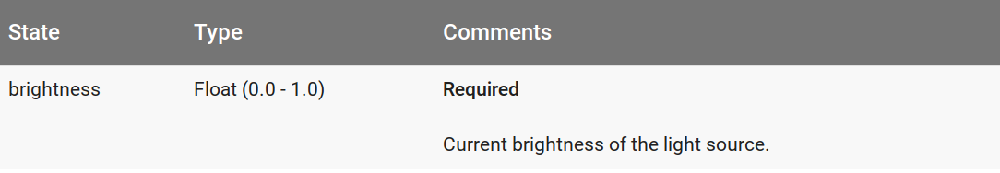


---
###### States类型（二)
枚举型
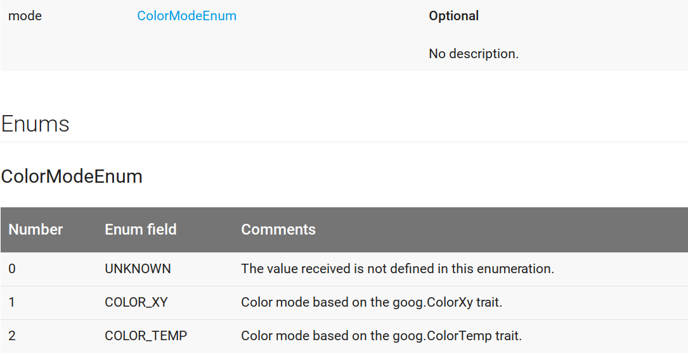


---
###### States类型（三)
结构体型
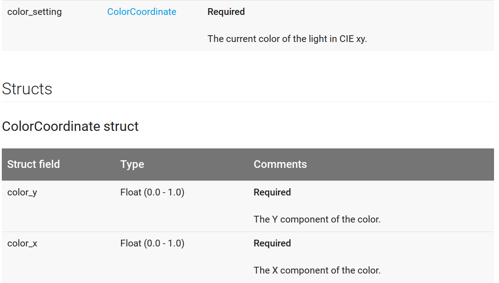


---
###### 设备Schemas(模式)
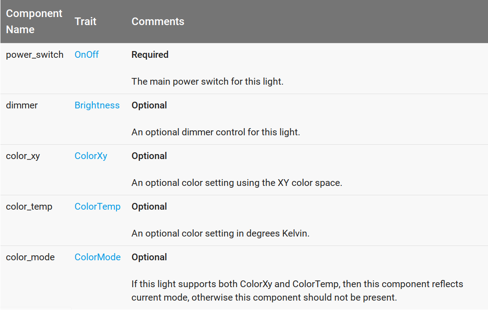
<small><small><small>以Light设备为例,设备由一系列组件组成，组件对应一个trait和trait当前的state(trait和组件的关系还有点模糊，目前的理解就是一个组件可以响应某一个trait的命令并且能获取该trait的当前状态)，设备可以从标准traits中选取自己需要的traits</small></small></small>


---
###### 设备Schema文件格式
<small><small>git clone https://weave.googlesource.com/weave/schema 
当前支持的设备的schema文件，由于需要一些权限不下来（libiota可以下载下来)，所以具体的schema文件格式还不知道，但libiota内有已经生成好的.c／.h文件可以直接编译使用</small></small>
+ <small><small>每一个支持的设备类型生成一对.c/.h文件，生成的接口以设备名为前缀</small></small>
	- <small><small><small>创建设备/销毁设备/获取设备traits个数/获取指定trait接口</small></small></small>
+ <small><small>每一个支持的trait生成一对.c/.h文件，生成的接口以trait名为前缀</small></small>
	- <small><small><small>创建trait/销毁trait/设置trait命令回调/派发命令/获取state接口</small></small></small>


---
###### 根据设备Schema文件生成的代码
<small><small>生成的LightDevice接口</small></small>
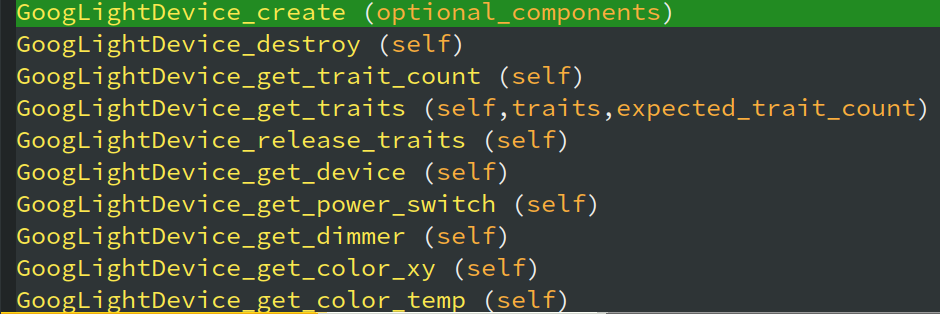
<small><small>生成的Brightness trait接口</small></small>
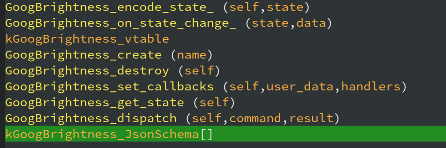


---
###### 程序运行环境搭建 (一)
<small><small><small>
1. 加入Weave Google Group 
	+ [join weave group](https://groups.google.com/forum/#!forum/weave-eap-acl)　<small>`(当前Weave API处于测试状态，未完全开放，需加入GROUP后才能访问Weave Cloud API)`</small>
2. 为自己的设备程序创建API key和OAuth 2.0 client ID 凭证
 	+ [create api key and credentials](https://console.developers.google.com/apis/credentials)
3. 保存key和client凭据到文件并导出到环境变量
```
#define IOTA_OAUTH2_API_KEY "xxxxxxxxxxxxxxxxxxxxxxxxxxxxxxxxxxxxxxxx"
#define IOTA_OAUTH2_CLIENT_ID "xxxxxxxxxxxxxxxxxxxxxxxxxxxxxxxxxxxxxxxxxxxxxxx"
#define IOTA_OAUTH2_CLIENT_SECRET "xxxxxxxxxxxxxxxxxxxxxxxx"
```
```
export IOTA_OAUTH2_KEYS_HEADER=~/path/to/iota_keys_header_file.h
```
3. 下载并编译测试程序
```
git clone https://weave.googlesource.com/weave/libiota
cd libiota
make -j lib
make -C examples/host/light
```
</small></small></small>


---
###### 程序运行环境搭建 (二)
<small><small><small>
1. 下载weave client测试工具
	+ [download weave client](https://developers.google.com/weave/downloads/weave_client-0.1.16.tar.gz)　<small>`(同样需要为该工具创建API key和client ID凭证，并使用Google账号登陆)`</small>
2. weave client工具同样需要创建API key和OAuth 2.0 client ID 凭证
 	+ [create api key and credentials](https://console.developers.google.com/apis/credentials)
3. 为weave client添加Google账号
	+ [add account tutorial](https://developers.google.com/weave/guides/apps-tools/cli-tool#add_a_new_account)
4. 使用weave client以自己登陆的Google账号身份为自己的设备申请一个provisionID(ticket)
```
user@xx-pc: ./weave_companion_client.sh device -n -m <manifest-id>
Provision ID: x-xxxxxxxx-xxxx-xxxx-xxxx-xxxxxxxxxxxx
Device Name: devices/x-xxxxxxxx-xxxx-xxxx-xxxx-xxxxxxxxxxxx
Expires on: 2016-04-25 07:56:55
```
</small></small></small>


---
###### 程序运行环境搭建 (三)
<small><small><small>
1. 以拿到的ticket启动测试程序
```
mkdir -p ~/.iota -m 0700
./out/host/examples/light/light -r xxxxxxxx-xxxx-xxxx-xxxx-xxxxxxxxxxxx
```
<small>`程序会以该ticket向weave server注册，同时意味着该设备同Google账号绑定，ticket也可以在程序运行时通过安全通道传递给设备，然后设备再去注册`</small>
2. 向设备发送控制命令
```
./weave_companion_client.sh device --list
...XXXXXX  HAL                   LIGHT     2016-05-23 17:35:44  Online
```
```
./weave_companion_client.sh command -d XXXXXX -n powerSwitch/onOff.setConfig state=on
./weave_companion_client.sh command -d XXXXXX -n dimmer/brightness.setConfig brightness=0.5
```
3. 测试设备打印
```
[(8208470.268)I light_traits.c:35] turning light on
[(8208470.268)I light_traits.c:49] Brightness: 50
```
<small>`怀疑weave server有bug,当前设备无法向weave server 注册成功，总是报ticket无效，Google+上有人问同样的问题，暂无人回答`</small>
</small></small></small>


---
###### 程序内部基本逻辑
<small><small><small>
1. 创建设备[LightDevice/OutletDevice/...]
  	+ 设置各个trait的命令回调函数
  	+ 设置各个state初值
2. 创建并启动daemon，daemon会以一个子线程运行并等待并处理各种消息
  	+ `注册消息`－收到后向weave server 注册
  	+ `网络事件监听消息`－处理网络变化通知
  	+ `应用消息`－该消息主要使用户线程能向daemon线程投递一些任务，比如更改trait的state
  	+ `其他消息`－(flush cloud data)等 
3. 程序利用状态机处理各种消息和事件，直到程序运行结束
	+ 云过来的各个控制命令首先遍历找到对应的trait,然后遍历找到对应的命令，调用其回调函数(命令参数与json的转换由自动生成的代码完成)
	+ 当用户更改trait的某一个state时，程序仅仅更改该state的版本号，状态机发现版本号更新会自动向云同步新state

</small></small></small>
　


---
###### 其他
<small><small><small>
1. libiota必须具有internet连接
2. libiota使用https同weave server通信，使用json传递数据（官网未介绍，代码分析得知，linux使用libcurl实现）
3. libiota不负责网络的配置与接入，设备实现者需要实现机制确保设备入网
4. libiota不负责设备的搜索发现，设备实现者需要实现机制发现设备
5. libiota不负责安全接收ticket,设备实现者需要实现安全通道将APP获得的ticket传递给设备

</small></small></small>


---
# **完**


